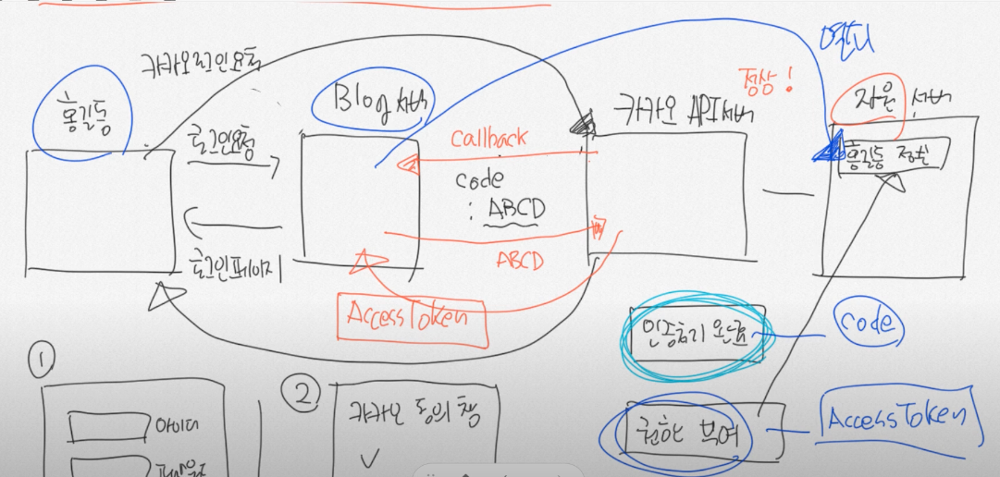

### Spring Security 강의

#### [메타코딩-Youtube](https://www.youtube.com/watch?v=GEv_hw0VOxE&list=PL93mKxaRDidERCyMaobSLkvSPzYtIk0Ah&index=1)

- 1강 - 환경설정 [V]
- 2강 - 시큐리티 설정 [V]
- 3강 - 시큐리티 회원가입 [V]
- 4강 - 시큐리티 로그인 [V]
- 5강 - 시큐리티 권한처리 [V]
- [선수강좌 - OAuth2.0 개념이해](https://www.youtube.com/watch?v=JBN5dCnLYnY&list=PL93mKxaRDidECgjOBjPgI3Dyo8ka6Ilqm&index=65) [V] 
- 6강 - 구글 로그인 준비
- 7강 - 구글 회원 프로필 정보 받아보기
- 8강 - Authentication객체가 가질수 있는 2가지 타입
- 9강 - 구글 로그인 및 자동 회원가입 진행 완료
- 10강 - 페이스북 로그인 완료
- 11강 - 네이버 로그인 완료
- 12강 - JWT를 이해하기전 세션에 대해 알아보자
- 13강 - JWT를 이해하기전 TCP에 대해서 알아보자
- 14강 - JWT를 이해하기전 CIA에 대해서 알아보자
- 15강 - JWT를 이해하기전 RSA에 대해서 알아보자
- 16강 - JWT를 이해하기전 RFC문서란
- 17강 - JWT 구조 이해
- 19강 - jwt를 위한 yml파일 세팅
- 18강 - JWT 프로젝트 세팅
- 20강 - jwt를 위한 security 설정
- 21강 - jwt Bearer 인증 방식
- 22강 jwt FIlter 등록 테스트
- 23강 - jwt 임시 토큰 만들어서 테스트 해보기
- 24강 - jwt를 위한 로그인 시도
- 25강 - jwt를 위한 강제 로그인 진행
- 26강 - jwt토큰 만들어서 응답하기
- 27강마지막 jwt토큰 서버 구축 완료

### OAuth2.0 정리
- 실제 User 1개 / Web상의 고유 유저 - 가입한 서버 만큼 N개
- 실제 User의 개인정보가 N개만큼 있다.
    - 개인정보를 한 곳에서 관리하는게 효율적이다. -> 특정 대형회사들이 한다.
- 장 / 단점 
  - 여러 User를 만들 필요가 없다.
  - 한 User만 관리하면 된다. 
- 도메인에 필요한 User field 별도로 관리하고, 이외 정보는 연동으로 처리
  - ex) 쇼핑몰 구매 누적 금액

### OAuth : Open Auth
- 인증처리를 대신 해준다.
- 기존 Client <-> Server 로그인 로직에 새로운 OAuth 대행 업체가 참여한다
- 인증 & 권한의 개념
- ***인증*** : user가 대행사로 로그인 -> server는 대행사 server로부터 callback
- ***권한*** : callback코드로 권한 요청 -> access token 발급 -> server가 대행사 server의 user정보로 접근 권한 가능
- 

- User : [리소스 오너]
- Application : [클라이언트]
- 인증 Server
- 리소스 서버

### Spring 공식 OAuth - client 라이브러리
- Facebook
- google
